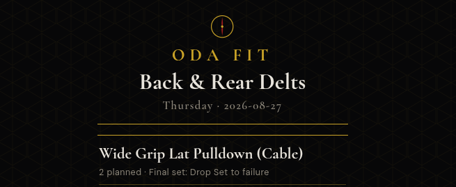

# Oda Fit (`fitd`)



A local private app for a [Hermes](https://github.com/NousResearch/hermes-agent) fitness ledger. One small C binary, served on your tailnet, writes the **same SQLite** the local `fit` CLI and the morning digest already read.

No cloud. No accounts. No second database. Chat is backup. The harness is the record.

## Why it sits next to Hermes

Hermes already owns the training day: a Fitness profile, a `fit` script, and `~/.hermes/profiles/fitness/fitness.db`. The 6am digest calls `fit digest`. `fit audit` flags a missing session or protein. Exercise names, `set_n`, and the weekday map have to stay honest or the morning brief lies.

The failure mode was gym chat. Numbers landed in a thread and never hit `fit`. The logger is the mechanical fix: at the rack, boxes per set, same file the harness already trusts.

`fitd` does not replace Hermes, the CLI, or the digest. It is a Tailscale-only writer for that ledger.

| | |
|---|---|
| Database | `$HOME/.hermes/profiles/fitness/fitness.db` |
| CLI | a `fit` script on the same machine (`today`, `set`, `marker`, `digest`, `audit`) |
| Rotation | copied from `fit` so `_match_exercise` / `_best_working` keep working |
| Dates | `America/Phoenix` — a UTC clock must not shift the training day |
| Hold | an unlogged training day stays due until it is logged; Monday fasting rest never becomes a training day. A set filed while held lands on the held date. |

Monday fasting rest and Tuesday legs do not move. The second rest floats (`meta.float_rest`). Protein is a separate marker, often later the same night. Saving a set never requires it.

## What you see

- Today's rotation, planned sets, last-session working-weight targets
- Empty boxes for reps and weight; log as you go
- Optional drop-set note
- Protein card: last filed value + date, and a box for today's grams
- Rest day: one line, no fake boxes

Dark ink, gold, crimson. Bind Tailscale IPv4 only; `0.0.0.0` is refused. The overlay network is the auth.

## Build

Needs `gcc` and `libsqlite3-dev`.

```
make
./fitd
```

| flag | default |
|---|---|
| `--bind IPV4` | `tailscale ip -4`, else `127.0.0.1` |
| `--port N` | `9120` |
| `--db PATH` | `$HOME/.hermes/profiles/fitness/fitness.db` |

If Tailscale is down it binds localhost. If the database cannot be opened it fails loud. It does not invent lifts or protein.

## HTTP

| | |
|---|---|
| `GET /` | HTML app |
| `GET /api/today` | plan, targets, logged sets, latest protein |
| `POST /set` | form or JSON `{exercise, reps, weight?, note?}` — always appends |
| `POST /protein` or `POST /api/protein` | form or JSON `{value, date?}` |
| `GET /health` | `ok` |

After a set, `fit log` and tomorrow's `fit digest` see it. Editing history is still the CLI.

## systemd (user unit)

Point `ExecStart` at the binary. After `tailscaled.service`. Do not pass `--bind 0.0.0.0`. This is a tiny extra listener — leave the rest of the harness alone.

## License

Source is here so other Hermes people can run the same idea on their own tailnet. Keep your numbers and your IPs off the internet.
